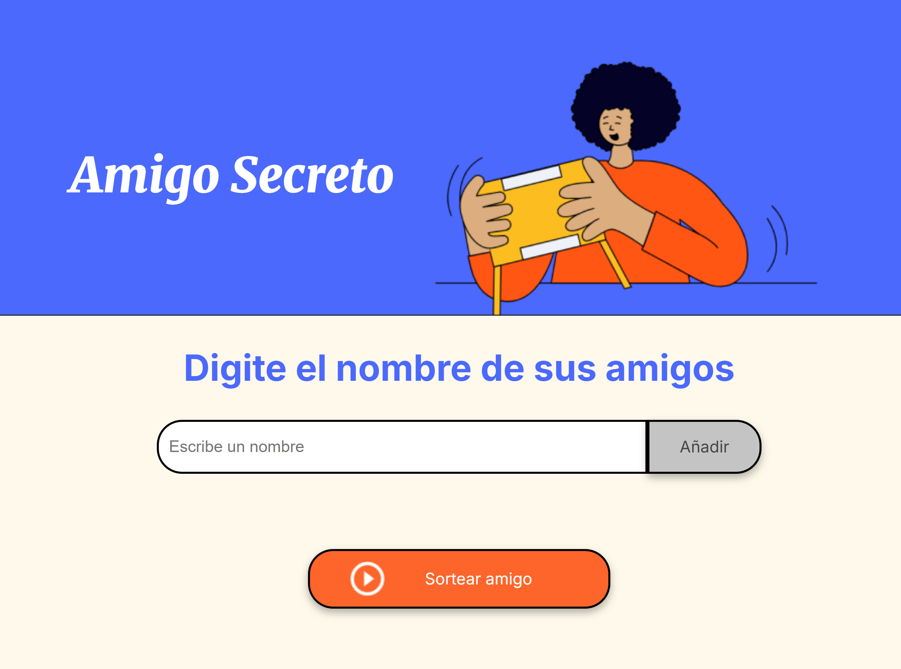

# Amigo Secreto 🎁

Este es un pequeño proyecto web que permite a los usuarios agregar nombres a una lista y luego realizar un sorteo aleatorio para determinar quién es el "amigo secreto".

## 🚀 Características

- Agregar nombres a una lista.
- Mostrar los nombres ingresados en pantalla.
- Sortear aleatoriamente un nombre de la lista.
- Interfaz amigable y sencilla.

## 📸 Capturas de Pantalla



## 📂 Estructura del Proyecto

```
📂 amigo-secreto-challenge
├── 📂 assets            # Imágenes y recursos
│   ├── amigo-secreto.png
│   ├── play-circle-outline.png
├── 📂 img               # Capturas de pantalla
│   ├── screenshot-amigoSecreto.png
├── 📄 index.html        # Estructura de la página web
├── 📄 style.css         # Estilos de la interfaz
├── 📄 app.js           # Lógica del programa en JavaScript
├── 📄 README.md        # Documentación del proyecto
```

## 🔧 Tecnologías Utilizadas

- HTML5
- CSS3
- JavaScript (ES6)

## 📌 Instrucciones de Uso

1. **Clona el repositorio**
   ```sh
   git clone https://github.com/Luana-Estanislau/AmigoSecreto-Challenge.git
   ```
2. **Abre el archivo `index.html` en tu navegador.**
3. **Agrega nombres en el campo de entrada y presiona "Añadir".**
4. **Presiona "Sortear amigo" para seleccionar aleatoriamente un nombre.**

## 🛠 Mejoras Futuras

- Implementar la funcionalidad de eliminar nombres de la lista.
- Agregar una opción para reiniciar el sorteo.
- Mejorar la interfaz con animaciones CSS.

## 📜 Licencia

Este proyecto está bajo la licencia MIT. Puedes usarlo, modificarlo y compartirlo libremente.

## 👨‍💻 Autor

**Luana Henriquez Estanislau de Araujo**

- [GitHub](https://github.com/Luana-Estanislau)
- [LinkedIn](https://www.linkedin.com/in/luana-henriquez-estanislau-de-araujo)

